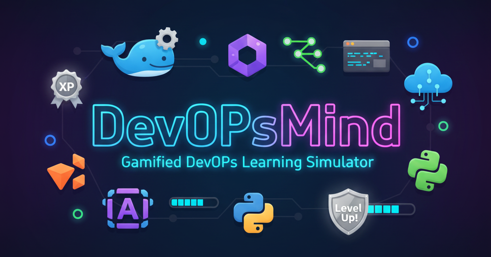
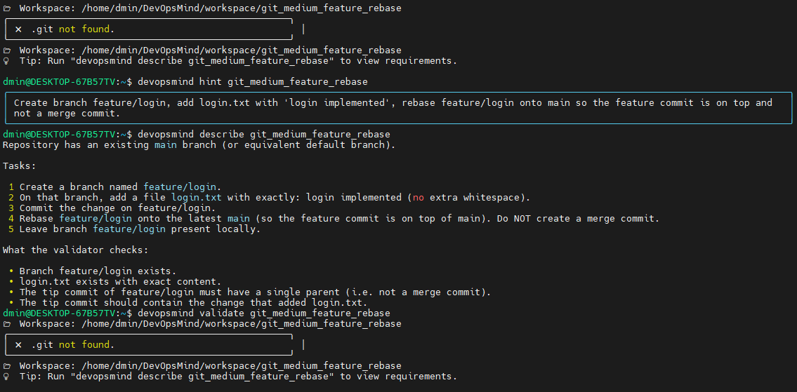
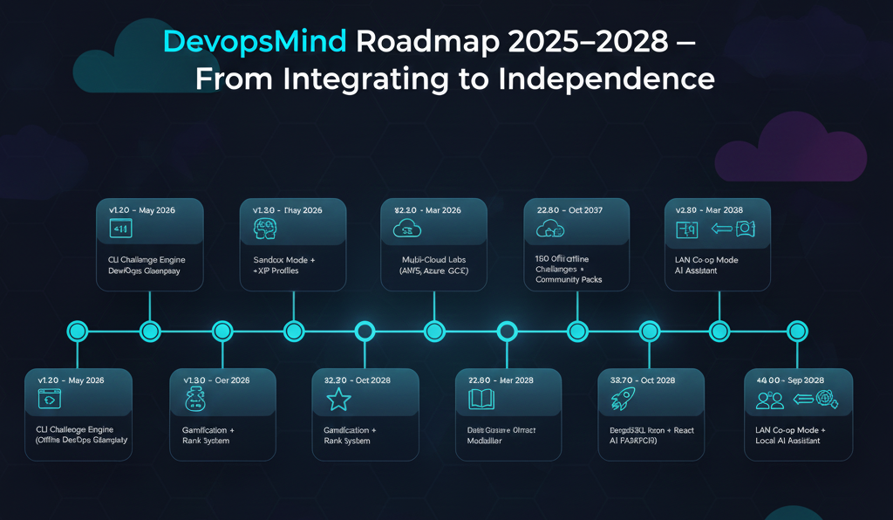

# 🧠 DevOpsMind — Gamified DevOps Learning Simulator

[](https://github.com/InfraForgeLabs/DevOpsMind/tags)
> 🏷️ **Latest Release:** Continuously evolving — Free · Local · Open · Forever



[](LICENSE)


[](https://github.com/InfraForgeLabs)

DevOpsMind is an **offline-first, CLI-based, gamified DevOps simulator**.
Solve real DevOps tasks, validate your solutions, earn **XP**, unlock **ranks**, and build muscle memory with hands-on DevOps workflows.

_Part of the **InfraForgeLabs** open DevOps innovation ecosystem._


---

# 🎥 Gameplay Demo




---
# 📘 Table of Contents

* [About This Project](#-devopsmind--gamified-devops-learning-simulator)
* [Repository Overview](#-project-architecture)
* [Quick Start](#-quickstart)
* [Features](#-features)
* [Deployment Options](#-installation-methods)
* [Integrations](#-stacks-covered)
* [Contribution](#-contributing)
* [Roadmap](#-roadmap)
* [Support](#-support--sponsorship)

---

# ✨ Features

* 🎮 30 curated DevOps challenges (10 stacks × 3 difficulty levels)
* 🧩 Fully offline gameplay
* 🔐 Local profiles, XP, ranks & badges
* 📦 Beautiful terminal UI using **rich**
* 🔧 YAML metadata, Markdown descriptions & Python validators
* 🔄 GitHub sync for updated challenge packs
* 🧱 Works on **Debian**, **Ubuntu**, **CentOS/RHEL**, **macOS**, **Windows (via WSL)**

---

# 🚀 Installation Matrix

| OS                | Recommended Method       | Notes                             |
| ----------------- | ------------------------ | --------------------------------- |
| **Ubuntu/Debian** | pipx                     | Best experience (isolated Python) |
| **Fedora/RHEL**   | pip                     | Works natively                    |
| **macOS**         | pipx via Homebrew Python | Perfect cross-platform setup      |
| **Windows**       | pipx (or WSL preferred)  | Use WSL for best compatibility    |
| **WSL**           | pipx                     | Recommended Linux experience      |

---

# 🧩 Installation Method — pipx (Official for v1.0.0)


## **1️⃣ Prerequisites**

### **Install Python 3.9+ and pipx**

#### Ubuntu / Debian

```bash
sudo apt update && sudo apt install -y python3 python3-venv python3-pip pipx
pip install --user pipx
pipx ensurepath
```

#### Fedora / RHEL / CentOS

```bash
sudo dnf install -y python3 python3-pip git
```
```bash
sudo ln -s "$HOME"/.local/bin/devopsmind /usr/local/bin/devopsmind
```

#### macOS (with Homebrew)

```bash
brew install python3 pipx
pipx ensurepath
```

#### Windows (PowerShell)

```powershell
py -m pip install --user pipx
py -m pipx ensurepath
```

---

## **2️⃣ Install DevOpsMind via pipx**

```bash
pipx install git+https://github.com/InfraForgeLabs/DevOpsMind.git
```
* (remove the pip install fallback to avoid confusion — pipx is your locked official method.)

This command will:

* Clone the official repository.
* Create a clean isolated virtual environment.
* Install all dependencies automatically.
* Expose the `devopsmind` CLI globally.

---

## **3️⃣ Verify Installation**

```bash
devopsmind
devopsmind list
```

✅ Expected output:

```
🧠 DevOpsMind v1.0.0
Total: 30 | Profile: default
```

---

## **4️⃣ Update to the Latest Version**

```bash
pipx upgrade devopsmind
```
* (remove the pip upgrade fallback to avoid confusion — pipx is your locked official method.)

---

## **5️⃣ Uninstall (if needed)**

```bash
pipx uninstall devopsmind
```
* (remove the pip uninstall fallback to avoid confusion — pipx is your locked official method.)

---

# 🧠 Notes

* `pipx` ensures your DevOpsMind installation stays isolated from system Python.
* Works perfectly across Linux, macOS, and WSL.

---

## 🧠 Automatic Leaderboard Sync
When you complete a challenge, DevOpsMind stores your stats in
`~/.devopsmind/pending_sync/`.

A GitHub Action running inside InfraForgeLabs/DevOpsMind automatically
adds those YAML files to the public `leaderboard` branch.

No credentials are shared; only codename, XP, rank, and counts are uploaded.

---

# 🧭 Quickstart

1. Create your profile (saved locally)

```bash
devopsmind
```

2. View all available stacks

```bash
devopsmind list
```

3. List only one stack

```bash
devopsmind list --stack docker
```

4. Play a challenge

```bash
devopsmind play docker_easy_basic_dockerfile
```

5.  Need help? View description or hint

```bash
devopsmind describe docker_easy_basic_dockerfile
devopsmind hint docker_easy_basic_dockerfile
```
6. Validate your work
```bash
devopsmind validate docker_easy_basic_dockerfile
```

7. Check your progress and XP
```bash
devopsmind stats
```
8. Push Score on Global Leaderboard
```bash
devopsmind submit
```

9. Global Leaderboard
```bash
devopsmind leardboard
```
10. Manage Profile
```bash
devopsmind profile create <username>
devopsmind profile login <username>
```

---

# 📚 Stacks Covered

* 🐧 Linux
* 💻 Bash
* 🌱 Git
* 🐍 Python
* ⚙️ Ansible
* 🐳 Docker
* ☸️ Kubernetes
* 🛳 Helm
* 🌍 Terraform
* 📈 Observability

---

# 🏗 Project Architecture

```
DevOpsMind/
├── src/devopsmind/
│   ├── cli.py
│   ├── engine.py
│   ├── profiles.py
│   ├── sync.py
│   ├── doctor.py
│   ├── leaderboard.py
│   ├── challenges/
│   │   ├── 01-linux/
│   │   ├── 02-bash/
│   │   ├── 03-git/
│   │   ├── 04-python/
│   │   ├── 05-ansible/
│   │   ├── 06-docker/
│   │   ├── 07-k8s/
│   │   ├── 08-helm/
│   │   ├── 09-terraform/
│   │   └── 10-observability/
│   └── entrypoint.py
├── docs/
├── dist/
├── scripts/bootstrap.sh
├── README.md
├── LICENSE
└── pyproject.toml
```

---

# 🛣 Roadmap



---

## 📘 Vision & Governance

These documents define the learning philosophy, strategy, and long-term roadmap of **DevOpsMind**, guiding its evolution from CLI simulator to offline Studio suite.

| File | Description |
|------|--------------|
| [`PHILOSOPHY`](vision/PHILOSOPHY.md) | Educational vision, core learning values, and open philosophy |
| [`STRATEGY`](vision/STRATEGY.md) | Development roadmap from CLI → Sandbox → Studio → AI |
| [`BUSINESS_MODEL`](vision/BUSINESS_MODEL.md) | Open education model and community-driven sustainability |
| [`CHANGELOG`](vision/CHANGELOG.md) | Full version roadmap (2026–2032) with release milestones |

---

# 🤝 Contributing

Pull requests welcome! Ensure validators remain deterministic.

---

# 📜 License

MIT License © 2025 **InfraForgeLabs**

---

# 💖 Support & Sponsorship

**DevOpsMind** is proudly built and maintained by **InfraForge Labs** as an open-source gamified DevOps learning platform.  

If you find this project valuable — whether you’re learning, teaching, or building with it — consider supporting its development.  
Your contribution helps keep **DevOpsMind** updated, free, and community-driven.

### ☕ Ways to Support

* 💎 GitHub Sponsors: [https://github.com/sponsors/gauravchile](https://github.com/sponsors/gauravchile)
* ☕ Buy Me a Coffee: [https://buymeacoffee.com/gauravchile](https://buymeacoffee.com/gauravchile)

> Every contribution — a coffee ☕, a star ⭐, or a pull request 🧩 — helps keep **DevOpsMind** alive, growing, and improving for everyone.

---

## ⭐ Support & Credits

Developed & maintained by [Gaurav Chile](https://github.com/gauravchile)

Founder, **InfraForgeLabs**

> 💡 DevOpsMind is fully modular — challenge packs, validators, and installers auto-update via GitHub.
>Ideal for DevOps learners, professionals, teams, and training environments.

[]()

---
